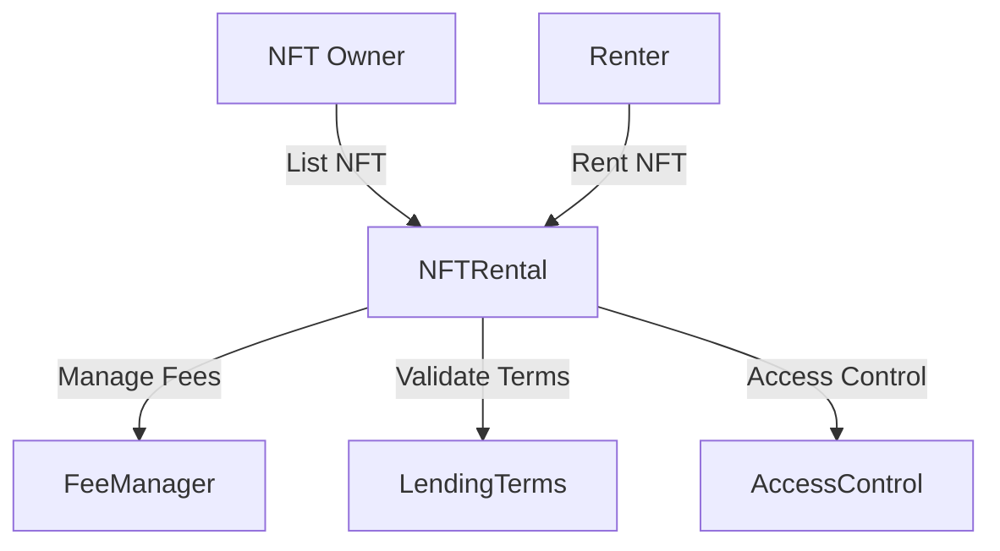

# 🎨 NFT Rental Protocol

<div align="center">

[](https://github.com/free4fun/nft-rental/actions)
[](https://coveralls.io/github/free4fun/nft-rental?branch=main)
[](https://www.gnu.org/licenses/gpl-3.0)
[](https://docs.soliditylang.org/)
[](https://hardhat.org/)

*A secure, efficient, and user-friendly protocol for renting NFTs on the Ethereum blockchain.*

[Documentation](./docs) | [Contributing](./.github/CONTRIBUTING.md) | [Security](./.github/SECURITY.md)

</div>

## 📚 Table of Contents

- [Features](#-features)
- [Quick Start](#-quick-start)
- [Architecture](#-architecture)
- [Local Development](#-local-development)
- [Testing](#-testing)
- [Deployment](#-deployment)
- [Security](#-security)
- [Contributing](#-contributing)
- [License](#-license)

## 🌟 Features

- **Secure NFT Rentals**: Collateral-based system ensuring safe returns
- **Flexible Terms**: Customizable rental duration and pricing
- **Fee Management**: Automated fee distribution for platform, creators, and referrals
- **Role-Based Access**: Granular permission control system
- **Upgradeable Contracts**: Future-proof architecture using proxy patterns
- **Gas Optimized**: Efficient implementations to minimize transaction costs

## 🚀 Quick Start

### Prerequisites

- Node.js >= 20.18.1
- Yarn or npm
- Git

### Installation

```bash
# Clone the repository
git clone https://github.com/free4fun/nft-rental.git
cd nft-rental

# Install dependencies
yarn install

# Set up environment
cp .env.example .env
# Edit .env with your configuration

# Compile contracts
yarn compile

# Run tests
yarn test
```

## 🏗 Architecture



### Core Contracts

- **NFTRental.sol**: Main protocol contract
- **FeeManager.sol**: Fee calculation and distribution
- **LendingTerms.sol**: Rental parameters management
- **AccessControl.sol**: Permission management

## 💻 Local Development

```bash
# Start local node
yarn hardhat node

# Deploy contracts locally
yarn deploy:local

# Run integration tests
yarn test:integration
```

### Development Tools

- **Hardhat**: Development environment
- **Ethers.js**: Ethereum library
- **OpenZeppelin**: Security-audited contract components
- **Solhint**: Solidity linter
- **Prettier**: Code formatter

## 🧪 Testing

```bash
# Run all tests
yarn test

# Generate coverage report
yarn coverage

# Run specific test
yarn test test/NFTRental.test.ts
```

### Test Coverage

| Contract | Coverage |
|----------|----------|
| NFTRental.sol | 0% |
| FeeManager.sol | 0% |
| LendingTerms.sol | 0% |
| AccessControl.sol | 0% |

## 📦 Deployment

### Mainnet Deployment

```bash
# Deploy to mainnet
yarn deploy:mainnet

# Verify contracts
yarn verify:mainnet
```

### Testnet Deployment

```bash
# Deploy to Sepolia
yarn deploy:sepolia

# Verify contracts
yarn verify:sepolia
```

## 🔒 Security

### Audit Status

- [Audit Report 1](./audits/reportYYYY-MM-DD-HH-mm.pdf) - Date: YYYY-MM-DD
- [Bug Bounty Program](./SECURITY.md)

### Security Measures

- Reentrancy Guards
- Access Controls
- Integer Overflow Protection
- Emergency Pause Functionality

## 🤝 Contributing

We welcome contributions! Please see our [Contributing Guidelines](./.github/CONTRIBUTING.md) for details.

### Development Process

1. Fork the repository
2. Create your feature branch
3. Commit your changes
4. Push to the branch
5. Create a Pull Request

## 🙏 Acknowledgements

- OpenZeppelin for secure contract components
- Hardhat team for development tools
- Ethereum community for feedback and support

## 📄 License

This project is licensed under the GNU General Public License v3.0 - see the [LICENSE](LICENSE) file for details.

---

<div align="center">

Built with ❤️ by [free4fun](https://www.mauricio.com.es)

[Website](https://www.mauricio.com.es) · [Twitter](https://twitter.com/fr334fun) · [Discord](https://discordapp.com/users/free4fun)

</div>
