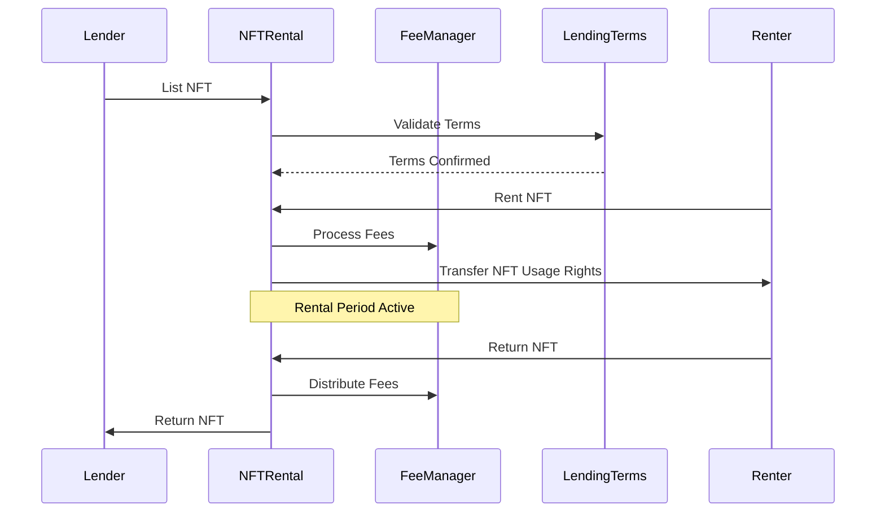

# NFT Rental System - System Design

## Overview

The NFT Rental System is a decentralized protocol that enables NFT owners to rent out their assets while maintaining ownership rights through a secure smart contract system.

## Core Components

### Smart Contracts Architecture

1. **NFTRental.sol**
 - Main contract handling rental operations
 - Manages listings, rentals, and returns
 - Integrates with other system components

2. **FeeManager.sol**
 - Fee calculation and distribution
 - Supports multiple fee types:
   - Platform fees (2.5%)
   - Creator royalties (5%)
   - Referral fees (1%)

3. **LendingTerms.sol**
 - Defines rental parameters
 - Manages collateral requirements
 - Handles penalty calculations

4. **AccessControl.sol**
 - Role-based access control
 - System administration
 - Emergency functions

## System Flow

## Security Measures

1. **Access Control**
 - Role-based permissions
 - Admin functions protected
 - Emergency pause functionality

2. **Economic Security**
 - Collateral-based system
 - Automated penalty calculation
 - Fee distribution safeguards

3. **Technical Security**
 - Reentrancy protection
 - Integer overflow prevention
 - Gas optimization

## Upgrade Path

The system implements the OpenZeppelin upgradeable contracts pattern:
- Proxy contracts for upgradeability
- State variables properly managed
- Implementation contracts immutable
